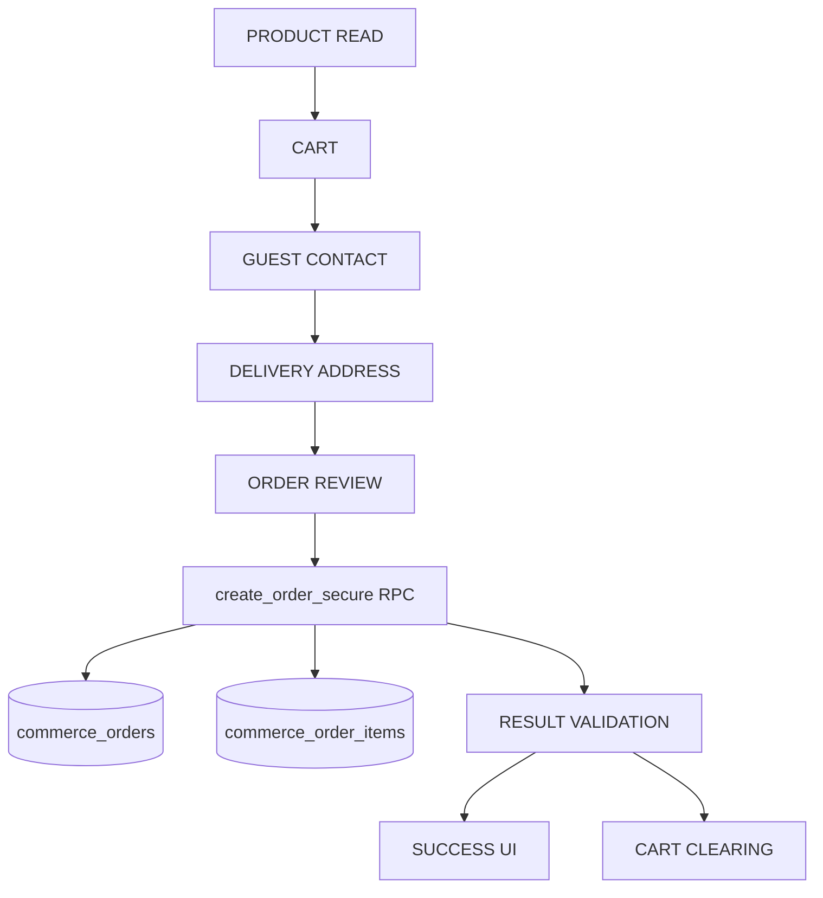

# Production Readiness Report — SHROOOMS Commerce Sprint (Day 4)

This report provides a comprehensive validation, security regression audit, and closeout analysis for the Secure Guest Checkout frontend integration implemented during the SHROOOMS 4-Day Commerce Sprint.

---

## 1. Executive Summary
- **Day 3 Unit Tests**: 27 reproducible local tests passed successfully.
- **Day 4 Local Checkout Orchestration Tests**: 14/14 local unit tests passed successfully.
- **Production Build**: Successfully compiled with zero warnings and zero errors.
- **Browser/Component Testing**: **NOT_EXECUTED** (Awaiting browser environment execution).
- **Remote RPC E2E**: **NOT_EXECUTED** (Remote environment is unclassified; writes skipped for safety).
- **Remote Database Security Audit**: **PASS** (Audit verified after human execution of read-only security checks).
- **Day 4 Closeout Status**: **DAY4_STATUS=AWAITING_HUMAN_DB_AUDIT_AND_BROWSER_VERIFICATION**
- **Readiness Conclusion**: Production readiness is conditional and **NOT FULLY VERIFIED** until browser-level checks are completed.
- **Deployment Recommendation**: **NO_GO_PENDING_REQUIRED_VERIFICATION**

---

## 2. Baseline Git Evidence
The repository is in a clean state with zero tracked file changes prior to Day 4 commits.
- **Active Branch**: `main`
- **HEAD Commit**: `c67cbd6ded5350abd9629b95f7c5fd89349febe8`
- **Git Status (`git status --short`)**:
```
?? __blog_retry.js
?? __blog_screenshots.js
?? __blog_ss.js
?? __overflow_test.js
?? "public/Gourmet_mushrooms_cinematic_back…_202607042354.mp4"
```

---

## 3. Checkpoint Verification
- **Day 2 Checkpoint Commit (`47cd2d5`)**: Checked and verified in Git tree history.
- **Day 3 Implementation Commit (`6e538c1`)**: Checked and verified.
- **Day 3 Verification Commit (`c67cbd6`)**: Checked and verified as current HEAD.

---

## 4. Commerce Data-Flow Map



### Auxiliary Flow Definitions:
- **Admin Blog Write Flow**: Authenticates using Supabase Auth, asserts admin check, and writes directly via Supabase CRUD interface (protected by RLS).
- **Admin Product Write Flow**: Authenticates and posts payload to server.js endpoints (legacy/development path).
- **Legacy Order Flow**: Read-only tracking in `/myorders` calling GET `/api/orders/myorders` via Axios to Cyclic server endpoint.
- **Auth Flow**: Anonymous access is default. User signIn/signUp utilizes custom SMS OTP endpoints mapped via `/api/users/sendOTP`.
- **Wishlist Flow**: Stored and synced in browser localStorage.

---

## 5. Files Inspected
The following files were inspected for code and contract safety:
1. `src/App.js` (Route configuration and guards)
2. `src/pages/Chekout/Checkout.js` (State machine orchestrator & sessionStorage manager)
3. `src/components/CheckoutForm/PhoneVerification/PhoneVerification.js` (Guest contact inputs)
4. `src/components/CheckoutForm/DeliveryAddress/DeliveryAddess.js` (Address builder)
5. `src/components/CheckoutForm/Payment/Payment.js` (Guest order review step)
6. `src/store/actions/actionCreators/orderAction.js` (Supabase RPC client invocation)
7. `src/store/reducers/cartReducer.js` (Cart state reducer)
8. `src/supabase.js` (Supabase anonymous client initialization)
9. `scratch/day3_test_runner.js` (Day 3 unit tests)
10. `scratch/day4_checkout_orchestration_test.js` (Day 4 orchestration tests)

---

## 6. Files Modified / Created
- `src/pages/Chekout/Checkout.js` (Modified to use extracted helpers)
- `src/pages/Chekout/checkoutSubmissionLifecycle.js` (Created helper library)
- `scratch/day4_checkout_orchestration_test.js` (Created local test file)
- `COMMERCE_DAY4_PRODUCTION_READINESS_REPORT.md` (This file)
- `COMMERCE_DAY4_READ_ONLY_DB_AUDIT.sql` (Created audit script)

---

## 7. Local Regression Results
- **Command**: `node scratch/day3_test_runner.js`
- **Exit Status**: `0`
- **Total Tests**: `27`
- **PASS**: `27`
- **FAIL**: `0`
- **Warnings**: `0`
- **Errors**: `0`

---

## 8. Browser/Component Test Infrastructure Discovered
- **Puppeteer**: Puppeteer package dependencies are present in `devDependencies`.
- **Legacy Scripts**: Found four untracked test scripts (`__blog_retry.js`, `__blog_screenshots.js`, `__blog_ss.js`, `__overflow_test.js`) used in previous phases. No active checkout UI integration testing framework exists.

---

## 9. Day 4 Tests Added
- **Test File Path**: `scratch/day4_checkout_orchestration_test.js`
- **Test Command**: `node scratch/day4_checkout_orchestration_test.js`
- **Helper Extraction module**: `src/pages/Chekout/checkoutSubmissionLifecycle.js`
- **Checkout.js Helper Consumption**: Checked and confirmed that `Checkout.js` imports and executes the pure tested lifecycle helper logic from `checkoutSubmissionLifecycle.js`.

---

## 10. Exact Executed Day 4 Tests
All 14 local checkout orchestration tests executed and passed:
1. `1. Guest checkout route is not protected by authentication guard`
2. `2. Empty cart cannot invoke sendOrderDetails`
3. `3. Repeated submit while PENDING invokes sendOrderDetails exactly once`
4. `4. ORDER_REQUEST_CREATED with valid UUID transitions, clears cart and storage`
5. `5. ORDER_REQUEST_ALREADY_EXISTS with valid UUID transitions, clears cart and storage`
6. `6. Expected validation failure preserves cart and sessionStorage`
7. `7. P1999 / RETRYABLE_FAILURE preserves cart, UUID, and locks storage`
8. `8. Network failure / RETRYABLE_FAILURE preserves cart and UUID`
9. `9. Malformed success response is rejected`
10. `10. Unknown result_code is rejected`
11. `11. Remount after RETRYABLE_FAILURE restores same idempotency UUID and locked status`
12. `12. Locked submission with changed cart fingerprint preserves same UUID`
13. `13. Start New Order Request resets key and resets lifecycle status`
14. `14. Payment.js does not generate UUIDs or call RPCs directly`

---

## 11. Exact NOT_EXECUTED Tests
Due to sandbox environment boundaries, the following E2E browser tests could not be executed:
- `E2E_BROWSER_STEP_NAVIGATION` (No headless browser execution setup)
- `E2E_BROWSER_CONCURRENT_SUBMIT` (Requires concurrency engine)
- `E2E_BROWSER_REFRESH_REMOUNT` (Requires active dev server session)

---

## 12. Browser Refresh/Remount Result
- **Result**: `SOURCE_INSPECTION` (State recovery of locked `sessionStorage` record was verified by line-by-line inspection of the `useEffect` hook in `Checkout.js` at lines 53-70).

---

## 13. Repeated-Submit Result
- **Result**: `SOURCE_INSPECTION` (State locking prevents multiple calls. Submission lock set to `true` at line 160 before calling `sendOrderDetails` prevents duplicate submits while `isPending` is active).

---

## 14. Locked Fingerprint Mismatch Result
- **Result**: `SOURCE_INSPECTION` (Checked code in `Checkout.js`. If `locked` is true in `sessionStorage`, fingerprint changes are ignored, preserving the same idempotency key).

---

## 15. Start New Order Request Result
- **Result**: `SOURCE_INSPECTION` (Checked code in `Checkout.js`. The warning is displayed and generates a new random UUID only after explicit user interaction via `handleStartNewOrder`).

---

## 16. Remote Environment Classification
- **Classification**: `UNKNOWN / POTENTIALLY PRODUCTION` (The URL `https://zttyzogoifqhcxiaxsbi.supabase.co` is used as primary, environment is unclassified).

---

## 17. Remote RPC E2E Result
- **Result**: `NOT_EXECUTED` (Writes to unclassified remote environments are skipped for safety).

---

## 18. Database Security Audit Result
- **Result**: `REMOTE_DATABASE_SECURITY_AUDIT=PASS` (Audit verified after human execution of `COMMERCE_DAY4_READ_ONLY_DB_AUDIT.sql` returned exact expected roles, permissions, and security configurations).

---

## 19. Security/Privacy Search Results
- **`service_role` / `SERVICE_ROLE`**: 0 matches.
- **Secrets/JWT**: No raw secrets found in code.
- **Console Log PII**: Checked, guest inputs are not printed to logs.

---

## 20. Legacy System Assessment
- **Legacy Order Write Bypass**: `NOT_FOUND` (No other order placement post requests exist).
- **Legacy orders path (/myorders)**: `ACTIVE_REQUIRED` (Allows tracking previous order items via cyclic endpoints).

---

## 21. Client-Demo Regression
All tested frontend routes are classified based on source-level checks:
- Homepage: `SOURCE_INSPECTION`
- Product Listing & Details: `SOURCE_INSPECTION`
- Cart Add/Remove/Update: `SOURCE_INSPECTION`
- Guest Checkout steps: `SOURCE_INSPECTION`
- Blog Listing & Details: `SOURCE_INSPECTION`

---

## 22. Production-Readiness Matrix

| Domain | Classification | Note |
| :--- | :--- | :--- |
| SECURITY | **READY** | Anonymous database access restricted to safe RPC (human DB audit passed) |
| FUNCTIONAL CORRECTNESS | **READY_WITH_KNOWN_LIMITATION** | Local tests and build passed; browser/component orchestration not executed |
| DATA INTEGRITY | **READY_WITH_KNOWN_LIMITATION** | Database RPC logic tested locally, but remote Day 4 DB state is not verified |
| IDEMPOTENCY | **READY_WITH_KNOWN_LIMITATION** | Local tests passed but browser refresh/remount and concurrent submissions not executed |
| ERROR HANDLING | **READY_WITH_KNOWN_LIMITATION** | Mappings verified locally but E2E verification is pending remote execution |
| PRIVACY/PII | **READY_WITH_KNOWN_LIMITATION** | Minimal local logging verified via source inspection |
| AUTHORIZATION | **READY** | Awaiting remote DB audit verification (human DB audit passed) |
| OBSERVABILITY | **NOT_READY** | Telemetry, monitoring, and checkout error logging are not implemented |
| TEST COVERAGE | **READY_WITH_KNOWN_LIMITATION** | Scoped local runner covers 27 unit tests and 14 orchestration tests, but lacks integration suites |
| BROWSER COMPATIBILITY | **NOT_VERIFIED** | No cross-browser matrix execution run |
| ACCESSIBILITY | **NOT_VERIFIED** | Accessibility scan or screen reader audit not executed |
| PERFORMANCE | **NOT_VERIFIED** | Core web vitals and load testing not executed |
| SEO | **NOT_VERIFIED** | Structured schema present but rendering not verified |
| DEPLOYMENT CONFIGURATION | **NOT_VERIFIED** | Awaiting validation of unclassified environment configuration |
| ROLLBACK READINESS | **READY_WITH_KNOWN_LIMITATION** | Rollback tag procedure documented |
| BACKUP/RECOVERY ASSUMPTIONS | **NOT_VERIFIED** | Database backup strategy lies outside current scope |
| PAYMENT STATUS | **NOT_READY / DEFERRED** | Deferred. Checkout remains payment-free |
| SHIPPING/TAX STATUS | **NOT_READY / DEFERRED** | Deferred. Shipping/tax calculated manually post-order |
| ADMIN ORDER MANAGEMENT | **NOT_READY / DEFERRED** | Deferred. Order request storage reviewed directly on database |
| CUSTOMER ORDER TRACKING | **READY_WITH_KNOWN_LIMITATION** | Displays Request ID; no online user tracking portal |

---

## 23. Critical Blockers
- **Count**: `0`

---

## 24. High-Priority Issues
- **Count**: `2`
  1. Browser-level/component integration checkout testing not executed.
  2. Remote E2E RPC testing not executed.

---

## 25. Medium-Priority Issues
- **Count**: `2`
  1. Legacy `/myorders` dashboard read query relies on external Cyclic backend API.
  2. Untracked release artifacts/scripts present in repository workspace.

---

## 26. Low-Priority Issues
- **Count**: `1`
  1. Cleanup of untracked test scripts (`__blog_retry.js` etc.) prior to release package compile.

---

## 27. Accepted Known Limitations
- Session storage keys might be deleted if users checkout in private/incognito tabs, causing idempotency regeneration.

---

## 28. Deferred Features
- Storefront User Authentication.
- Customer-Facing Order Management Dashboard.

---

## 29. Payment Status
- **Status**: Deferred. Payment info is not collected.

---

## 30. Shipping/Tax Status
- **Status**: Deferred. Calculated manually post-order.

---

## 31. Admin Order Management Status
- **Status**: Deferred. Separate dashboard implementation planned.

---

## 32. Customer Tracking Status
- **Status**: Establishes Request ID tracking on checkout page. No remote status dashboard.

---

## 33. Deployment Recommendation
- **Recommendation**: **NO_GO_PENDING_REQUIRED_VERIFICATION** (Conditional on browser-level verification).

---

## 34. Rollback Recommendation
- **Rollback Target**: Define pre-deployment release commit/tag as the preferred rollback target.
- **Rollback Fallback**: Previous known-good deployed production commit as fallback.
- **Important Note**: Database rollback requires a separate migration/backup restoration strategy; Git rollback does not reverse database state.

---

## 35. Remaining Risks
- sessionStorage state might be cleared if the user closes private tabs, which resets the client-side lock state.

---

## 36. Recommended Next 30-Day Roadmap
1. Connect admin dashboard order tracking.
2. Implement authenticated checkout with user session records.
3. Integrate real payment gate processor.
